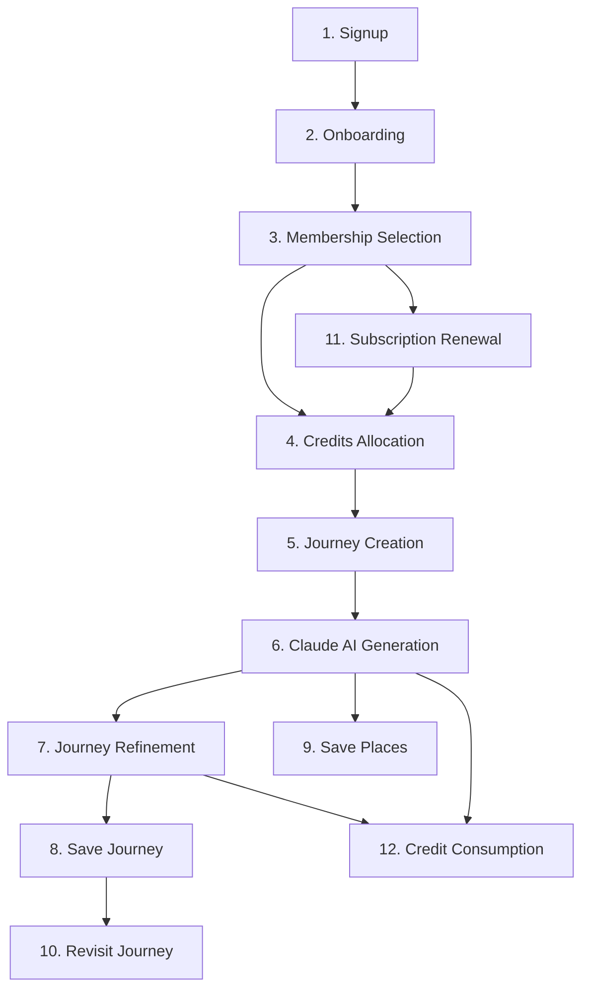

# Wayheld — Business Flow

The complete lifecycle of a Wayheld user, mapped **before implementation** to
validate the architecture. Each step lists the **database tables** touched, the
**APIs** that will exist, the **UI screens** involved, and the **business rules**
that govern it.

References: [prisma/schema.prisma](prisma/schema.prisma) ·
[DATA_ARCHITECTURE.md](DATA_ARCHITECTURE.md)

> **Status:** planning only. No backend/API code is implemented yet. API routes
> below are the intended `/api/v1/*` contract (stable for web + future mobile).

---

## Legend & conventions

- **Tables** use the model names from the Prisma schema (snake_case table in
  parentheses where useful).
- APIs are versioned `/api/v1/...`; mutations run as Route Handlers / Server
  Actions inside DB transactions where multiple tables change atomically.
- "Writes" = rows created/updated; "Reads" = rows queried.
- Money is always reconciled against **Stripe**; credits against the
  **CreditTransaction ledger**.

---

## Lifecycle overview

---

## 1. Signup

**Goal:** create an authenticated account.

| Aspect | Detail |
| --- | --- |
| **Tables (write)** | `User`, `Account` (OAuth) or `User.passwordHash` (credentials), `Session`, `VerificationToken` (email verify), `CreditWallet` (created empty), `UserActivity` (`SIGN_UP`) |
| **Tables (read)** | `User` (email uniqueness) |
| **APIs** | `POST /api/v1/auth/signup`, `POST /api/v1/auth/callback/:provider` (NextAuth), `POST /api/v1/auth/verify-email` |
| **UI screens** | `/signup`, OAuth consent, email-verify prompt |
| **Business rules** | Email unique (case-insensitive); password ≥ 8 chars, hashed (argon2/bcrypt) — never stored plain; OAuth users have `passwordHash = null`; a `CreditWallet` is provisioned at signup with `balance = 0`; `status = ACTIVE`; terms acceptance required before account creation. |

**Outcome:** session established → redirect to **Onboarding**.

---

## 2. Onboarding

**Goal:** learn how the user travels (the 6-step flow already built on the
frontend).

| Aspect | Detail |
| --- | --- |
| **Tables (write)** | `Profile` (name, locale, timezone), `TravelPreference` (pace, transport, budget, units, toggles), `ProfileTravelStyle` (join, Step 2), `ProfileInterest` (join, Step 3), `Profile.onboardingCompletedAt`, `UserActivity` (`ONBOARDING_STEP`, `ONBOARDING_COMPLETE`) |
| **Tables (read)** | `TravelStyle`, `Interest` (seeded catalogs to render options) |
| **APIs** | `GET /api/v1/onboarding/options` (styles+interests), `PATCH /api/v1/onboarding` (save step), `POST /api/v1/onboarding/complete` |
| **UI screens** | `/onboarding` steps 1–6 (Account, Travel Style, Interests, Pace, Preferences, Complete) |
| **Business rules** | Per-step validation mirrors the client (`useOnboarding.canAdvance`); Step 2 = exactly 1 style; Step 3 = ≥ 1 interest; Step 4 = exactly 1 pace; Step 5 = ≥ 1 preference; partial progress is persistable (resume later); `onboardingCompletedAt` set only when all required steps pass; catalogs referenced by stable `slug`. |

**Outcome:** a complete `Profile` + `TravelPreference` → **Membership
Selection**.

---

## 3. Membership Selection

**Goal:** choose Free, Pay-Per-Journey, or Premium.

| Aspect | Detail |
| --- | --- |
| **Tables (write)** | `Subscription` (created `INCOMPLETE`/`TRIALING`), `UserActivity` (`SUBSCRIPTION_CHANGED`) |
| **Tables (read)** | `MembershipPlan` (active plans + Stripe price ids), existing `Subscription` |
| **APIs** | `GET /api/v1/plans`, `POST /api/v1/checkout/session` (Stripe Checkout), `POST /api/v1/billing/portal` (Stripe Customer Portal) |
| **UI screens** | `/membership` (the pricing section), Stripe Checkout (hosted), return/success screen |
| **Business rules** | Free needs no payment → no Stripe round-trip; Per-Journey is a `ONE_TIME` price; Premium is a `MONTH` subscription; price/currency come from **Stripe**, app only caches; choosing a paid plan creates a Stripe Customer if none exists (`Subscription.stripeCustomerId`); the `Subscription` only becomes `ACTIVE` after webhook confirmation (see Step 4). |

**Outcome:** Stripe Checkout initiated → on success, webhook drives **Credits
Allocation**.

---

## 4. Credits Allocation

**Goal:** grant the credits a plan entitles, driven by Stripe webhooks.

| Aspect | Detail |
| --- | --- |
| **Tables (write)** | `Subscription` (→ `ACTIVE`, `currentPeriod*`), `CreditTransaction` (`GRANT`), `CreditWallet` (`balance`, `lifetimeGranted`), `Notification` (`CREDIT`/`BILLING`), `UserActivity` |
| **Tables (read)** | `MembershipPlan` (`monthlyCredits`, `unlimitedCredits`), `CreditTransaction` (idempotency via `externalRef`) |
| **APIs** | `POST /api/v1/webhooks/stripe` (signature-verified): handles `checkout.session.completed`, `invoice.paid`, `customer.subscription.updated/deleted` |
| **UI screens** | Billing/credits widget on `/dashboard` (later); success toast/`Notification` |
| **Business rules** | **Idempotency:** each Stripe event id maps to `CreditTransaction.externalRef` (unique) — replays are no-ops; a `GRANT` writes `amount`, `balanceAfter`, and updates the wallet in the **same transaction**; Premium grants on each `invoice.paid` (renewal); Per-Journey grants exactly 1 journey credit; `unlimitedCredits` plans set a flag rather than minting balance; credits may carry `expiresAt`; ledger is **append-only** — never edit a prior grant. |

**Outcome:** wallet funded → user can create journeys.

---

## 5. Journey Creation

**Goal:** start a new journey from traveller intent.

| Aspect | Detail |
| --- | --- |
| **Tables (write)** | `Journey` (`status = DRAFT`, `originQuery`, params snapshot), `UserActivity` (`JOURNEY_CREATED`) |
| **Tables (read)** | `Profile`, `TravelPreference`, `ProfileInterest`, `ProfileTravelStyle` (to seed context), `CreditWallet`/`Subscription` (entitlement check) |
| **APIs** | `POST /api/v1/journeys` (create draft), `GET /api/v1/journeys`, `GET /api/v1/journeys/:id` |
| **UI screens** | `/journeys/new` (intent + dates + travelers), Journey Builder shell |
| **Business rules** | **Entitlement gate** before generation: user must have available credit OR `unlimitedCredits` OR an unused Per-Journey credit; the journey stores a **reproducible parameter snapshot** (pace, dates, durationDays, budget, travelerCount) so results are explainable; `durationDays` derived from start/end; a `DRAFT` costs nothing — credits are only consumed at generation (Step 6/12). |

**Outcome:** a `DRAFT` journey → **Claude AI Generation**.

---

## 6. Claude AI Generation

**Goal:** turn intent + preferences into a structured, geo-aware itinerary.

| Aspect | Detail |
| --- | --- |
| **Tables (write)** | `AiGeneration` (`kind = JOURNEY_PLAN`, `QUEUED→STREAMING→COMPLETED`), `AiPromptLog` (system/user/assistant turns), `JourneyStop` (created from output), `Journey` (`status GENERATING→READY`, `boundingBox`, `heroImageUrl`, `version++`), `CreditTransaction` (`CONSUMPTION`), `CreditWallet` (debit), `Notification` (`JOURNEY_READY`/`JOURNEY_FAILED`), `UserActivity` |
| **Tables (read)** | `Profile`, `TravelPreference`, interests/styles, `Journey` params |
| **APIs** | `POST /api/v1/journeys/:id/generate` (server-streamed), internal Claude client; Google Maps **Place** resolution to fill `googlePlaceId`/lat/lng on stops |
| **UI screens** | Journey Builder — generating state (skeleton/stream), then itinerary + map |
| **Business rules** | Validate Claude output with a **schema (Zod)** before persisting; build `JourneyStop` rows ordered by `order` (unique per journey); resolve each stop to a Google Place to guarantee map-ability; record `inputTokens`/`outputTokens`/`costMicroUsd`/`latencyMs`; **credit consumption is atomic with success** — a `FAILED` generation does **not** consume credit (or is auto-refunded via `REFUND`); on success emit `JOURNEY_READY`; raw prompts isolated in `AiPromptLog` (redactable). |

**Outcome:** a `READY` journey with stops + map framing.

---

## 7. Journey Refinement

**Goal:** iteratively adjust a journey ("slower", "remove Skye", "add 2 days").

| Aspect | Detail |
| --- | --- |
| **Tables (write)** | `JourneyRefinement` (`type`, `instruction`, `params`, `from/toVersion`), `AiGeneration` (`kind = JOURNEY_REFINEMENT`), `AiPromptLog`, `JourneyStop` (add/remove/reorder), `Journey` (`status REFINING→READY`, `version++`), `CreditTransaction` (per policy), `UserActivity` (`JOURNEY_REFINED`) |
| **Tables (read)** | `Journey` + current `JourneyStop`s + prior `JourneyRefinement`s (conversational memory for Claude) |
| **APIs** | `POST /api/v1/journeys/:id/refine`, `GET /api/v1/journeys/:id/refinements` |
| **UI screens** | Journey Builder — refine panel (NL input + quick actions: pace, add/remove stop, dates, avoid crowds) |
| **Business rules** | Each refinement is **immutable history** with `fromVersion`/`toVersion` for diffing; the prior refinements + stops are passed to Claude as context; **pricing policy** (configurable): light edits free, regenerations cost credit — define once and enforce server-side; reordering keeps `(journeyId, order)` unique; refinements only allowed on `READY`/`REFINING` journeys owned by the user. |

**Outcome:** an improved, versioned journey.

---

## 8. Save Journey

**Goal:** bookmark a journey for quick return (own or, later, shared).

| Aspect | Detail |
| --- | --- |
| **Tables (write)** | `SavedJourney` (`@@unique([userId, journeyId])`), `UserActivity` (`JOURNEY_SAVED`) |
| **Tables (read)** | `Journey` (ownership/visibility), `SavedJourney` (dedupe) |
| **APIs** | `POST /api/v1/journeys/:id/save`, `DELETE /api/v1/journeys/:id/save`, `GET /api/v1/saved/journeys` |
| **UI screens** | Journey Builder save toggle, `/dashboard` saved list |
| **Business rules** | Idempotent — saving twice is a no-op (unique constraint); a journey itself is already persisted, so "save" is a lightweight bookmark; deleting a journey cascades its saves. |

---

## 9. Save Places

**Goal:** bookmark individual destinations/stays/experiences.

| Aspect | Detail |
| --- | --- |
| **Tables (write)** | `SavedPlace` (`@@unique([userId, googlePlaceId])`), `UserActivity` (`PLACE_SAVED`) |
| **Tables (read)** | `SavedPlace` (dedupe), Google Maps Place details (name/geo/photo) |
| **APIs** | `POST /api/v1/places/save`, `DELETE /api/v1/places/:id`, `GET /api/v1/saved/places` |
| **UI screens** | Map/stop cards "save" action, `/dashboard` saved places, map pins |
| **Business rules** | Each place stores `googlePlaceId` + lat/lng so it renders on a map immediately; uniqueness prevents duplicate saves of the same Place; a place can be saved from a journey stop or from recommendations. |

**Related — Destination Recommendations:** `DestinationRecommendation` rows
(`source = CLAUDE/EDITORIAL`, `status`, `score`) are produced by an
`AiGeneration` (`kind = RECOMMENDATION`); the feed updates status
`SUGGESTED→VIEWED→SAVED/DISMISSED` and `RECOMMENDATION_CLICKED` activity; saving
one creates a `SavedPlace`.

---

## 10. Revisit Journey

**Goal:** return to a previously created/saved journey.

| Aspect | Detail |
| --- | --- |
| **Tables (write)** | `UserActivity` (`JOURNEY_VIEWED`), optional `Notification.readAt` |
| **Tables (read)** | `Journey` + `JourneyStop` + `JourneyRefinement` + `AiGeneration` (history) |
| **APIs** | `GET /api/v1/journeys/:id`, `GET /api/v1/journeys` (list/paginate) |
| **UI screens** | `/dashboard` (journeys list), Journey detail/builder, map |
| **Business rules** | Owner-only access (or shared visibility later); reads served from normalised stops with `Journey.metadata` as a fast denormalised cache; soft-deleted journeys (`deletedAt`) are hidden; revisiting is **free** (no credit). |

---

## 11. Subscription Renewal

**Goal:** keep Premium active and re-grant monthly credits.

| Aspect | Detail |
| --- | --- |
| **Tables (write)** | `Subscription` (`currentPeriod*`, `status`), `CreditTransaction` (`GRANT` on renew; `EXPIRATION` for lapsed credits), `CreditWallet`, `Notification` (`BILLING`), `UserActivity` (`SUBSCRIPTION_CHANGED`) |
| **Tables (read)** | `MembershipPlan`, `Subscription`, `CreditTransaction` (idempotency) |
| **APIs** | `POST /api/v1/webhooks/stripe` (`invoice.paid`, `invoice.payment_failed`, `customer.subscription.updated/deleted`), `POST /api/v1/billing/portal` |
| **UI screens** | Billing page / Stripe Customer Portal, dunning banners |
| **Business rules** | Renewal credits granted only on confirmed `invoice.paid` (idempotent via `externalRef`); `payment_failed` → `PAST_DUE` + dunning notification (grace period, not immediate lockout); `cancelAtPeriodEnd` keeps access until `currentPeriodEnd`, then `CANCELED`; **credit rollover policy** (e.g. cap or reset) enforced via `EXPIRATION` entries; Stripe remains source of truth for status. |

---

## 12. Credit Consumption

**Goal:** spend credits when AI work is performed (cross-cutting; happens in
Steps 6 & 7).

| Aspect | Detail |
| --- | --- |
| **Tables (write)** | `CreditTransaction` (`CONSUMPTION`, negative `amount`, `balanceAfter`, links `journeyId`/`aiGenerationId`), `CreditWallet` (`balance`, `lifetimeConsumed`), `UserActivity` (`CREDIT_SPENT`) |
| **Tables (read)** | `CreditWallet` (sufficient balance), `Subscription` (`unlimitedCredits`), `MembershipPlan` |
| **APIs** | internal credit service invoked by `generate`/`refine`; `GET /api/v1/credits` (balance + history) |
| **UI screens** | Credits widget, "insufficient credits → upgrade" modal, history list |
| **Business rules** | **Pre-authorise then commit:** check balance/entitlement before calling Claude; debit **atomically with a successful** generation; `unlimitedCredits` bypasses debit but still logs usage for cost analytics; insufficient balance blocks generation and surfaces an upgrade path; every debit records `balanceAfter` so the wallet cache can be rebuilt from the ledger; failures auto-`REFUND`; nightly reconciliation recomputes `CreditWallet.balance` from `CreditTransaction` and alerts on drift. |

---

## Cross-cutting concerns

- **Atomicity:** any step touching money/credits + domain rows runs in one DB
  transaction (e.g. generation success + stop creation + credit debit).
- **Idempotency:** all Stripe-driven writes key off `CreditTransaction.externalRef`
  / event ids; safe to replay.
- **Auditability:** `AiGeneration` + `AiPromptLog` capture every Claude call;
  `UserActivity` captures behaviour; `JourneyRefinement` captures evolution.
- **Authorization:** all journey/place/credit endpoints are owner-scoped; admin
  (`UserRole.ADMIN`) and `CURATOR` have elevated catalog access.
- **Privacy/GDPR:** soft-delete (`User.deletedAt`), redactable `AiPromptLog`,
  export endpoint reads all user-owned tables.
- **Mobile parity:** every API is `/api/v1` and returns the same shapes the web
  app uses; sessions already carry device metadata.

---

## Validation checklist (architecture ↔ flow)

| Flow need | Supported by schema? |
| --- | --- |
| Resume partial onboarding | ✅ `Profile.onboardingCompletedAt` nullable; joins additive |
| Idempotent billing | ✅ `CreditTransaction.externalRef @unique`, `Subscription.stripeSubscriptionId @unique` |
| Reproducible journeys | ✅ param snapshot on `Journey` + versioning |
| AI audit + cost control | ✅ `AiGeneration` tokens/cost + `AiPromptLog` |
| Map-ability everywhere | ✅ `googlePlaceId` + lat/lng on stops & places |
| Rebuildable balances | ✅ append-only ledger + `balanceAfter` |
| Refinement history | ✅ immutable `JourneyRefinement` with version diffs |
| Mobile + sharing later | ✅ stable enums/slugs, device metadata, save models |

No schema changes are required to support this flow — the foundation is ready
for implementation of Dashboard, Journey Builder, Claude and Maps.
