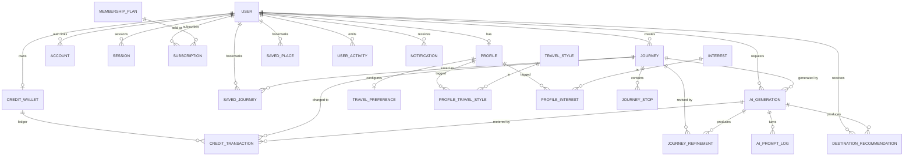

# Wayheld — Data Architecture

The foundational data design for the Wayheld slow-travel platform. This document
covers the entity model, relationships, enums, and scalability strategy. It is a
**planning artifact** — the [Prisma schema](prisma/schema.prisma) is the
machine-validated source of truth (validated with `prisma validate` + client
generation).

> **Greenfield.** This is a brand-new database. We do **not** migrate Bubble
> data. Bubble informed *requirements*, not structure.

---

## 1. Stack & principles

| Concern | Choice |
| --- | --- |
| Database | PostgreSQL 15+ |
| ORM | Prisma 7 (connection config in [prisma.config.ts](prisma.config.ts)) |
| App | Next.js 15 (App Router, Server Actions / Route Handlers) |
| Billing | Stripe (Products/Prices/Subscriptions/Webhooks) |
| AI | Anthropic Claude (auditable generations + prompt logs) |
| Maps | Google Maps (Place IDs + lat/lng on every location) |
| Mobile (future) | Same DB + API; token sessions already modelled |

**Design principles**
1. **Stripe is the source of truth for money.** We cache display prices but
   never compute billing from local data.
2. **Ledgers are append-only.** Credits and activity are immutable event logs;
   running balances are denormalised caches you can rebuild.
3. **AI is auditable.** Every Claude call is recorded with tokens, cost, status
   and (separately) the raw prompt turns — for debugging, cost control and
   safety/redaction.
4. **Geo-ready everywhere.** Any real-world location stores a Google
   `placeId` + `latitude/longitude`, so Maps "just works" later.
5. **Catalog vs. instance.** Seeded catalogs (`TravelStyle`, `Interest`,
   `MembershipPlan`) are stable; user data references them by `slug`/`tier`.
6. **API stability for mobile.** Stable slugs/enums and `@@map`ped snake_case
   tables keep a clean contract across web and native clients.

---

## 2. Entity Relationship Diagram (structure)

**Cardinality cheatsheet**
- `User 1—1 Profile`, `User 1—1 CreditWallet`
- `Profile 1—1 TravelPreference`
- `Profile *—* TravelStyle` and `Profile *—* Interest` (explicit join models)
- `User 1—* Subscription`, `MembershipPlan 1—* Subscription`
- `CreditWallet 1—* CreditTransaction`
- `Journey 1—* JourneyStop / JourneyRefinement`
- `AiGeneration 1—* AiPromptLog`

---

## 3. Models explained

### Identity & auth
- **User** — the root account. Holds `email`, optional `passwordHash` (null for
  pure OAuth), `role` (USER/CURATOR/ADMIN) and `status`. Uses **soft delete**
  (`deletedAt`) so we can anonymise while preserving referential history (GDPR).
- **Account** — NextAuth-style provider link (Google/Apple/credentials). Stores
  OAuth tokens; `@@unique([provider, providerAccountId])`.
- **Session** — server sessions; carries optional `userAgent`/`ipAddress` to
  support future device/session management for mobile.
- **VerificationToken** — email verification / passwordless tokens.

### Profile & onboarding
- **Profile** — 1:1 with User. Display identity (name, avatar, bio), home base
  (`homeCity/Country`) for feasibility heuristics, `locale`/`timezone`, and
  `onboardingCompletedAt`. This is exactly what the onboarding flow populates.
- **TravelPreference** — 1:1 with Profile. The onboarding answers as queryable
  columns: `pace`, `transport`, `budget`, `units`, plus the Step-5 boolean
  toggles (`avoidCrowds`, `regenerativeOnly`, …) and soft constraints
  (`maxTravelHoursPerDay`, `preferredTripLength`). An `extras` JSON captures
  open-ended needs (dietary/accessibility/languages) without schema churn.
- **TravelStyle / Interest** — seeded **catalogs**. Stable `slug` is the API
  contract; `sortOrder`/`isActive` drive the UI. Editing copy never breaks
  user references.
- **ProfileTravelStyle / ProfileInterest** — explicit many-to-many joins (not
  implicit) so we can attach a `weight` later for preference strength /
  personalisation.

### Billing — plans, subscriptions, credits
- **MembershipPlan** — catalog of the three tiers (FREE, PER_JOURNEY,
  PREMIUM). References Stripe `stripeProductId/stripePriceId`; caches a display
  `priceAmount/priceCurrency`; declares entitlements (`monthlyCredits`,
  `unlimitedCredits`, `features` JSON for gating).
- **Subscription** — a user's active/inactive plan with full Stripe lifecycle
  (`status`, `currentPeriod*`, `cancelAtPeriodEnd`, `trialEndsAt`). `onDelete:
  Restrict` on plan prevents deleting a plan that has subscriptions.
- **CreditWallet** — 1:1 with User; a denormalised `balance` plus
  `lifetimeGranted/Consumed` for fast reads.
- **CreditTransaction** — **append-only ledger**. Every grant/purchase/
  consumption/expiry is a row with `amount` (+/-), `balanceAfter`, optional
  links to the `journey`/`aiGeneration` that spent it, and an `externalRef`
  (unique) for **idempotent** Stripe webhook handling. Corrections are new
  `ADJUSTMENT` rows — never edits.

### Journeys — core product
- **Journey** — a planned trip. Stores the seed intent (`originQuery`,
  `region`), a reproducible **parameter snapshot** (`pace`, dates,
  `durationDays`, `budget`), a `status` state machine
  (DRAFT→GENERATING→READY→REFINING…), a `version` counter, a `boundingBox` for
  map framing, and a denormalised `metadata` payload for fast list reads.
- **JourneyStop** — ordered stops (`@@unique([journeyId, order])`). Carries
  `kind`, stay length (`nights`, `dayStart/End`), `highlights[]`, and full geo
  (`googlePlaceId`, `latitude/longitude`, `address`) for Maps.
- **JourneyRefinement** — an **immutable record** of each change request
  (`type`, natural-language `instruction`, structured `params`, `from/toVersion`)
  and a link to the `AiGeneration` that fulfilled it. This gives Claude
  conversational memory and gives us a full audit of how a trip evolved.

### Saves & recommendations
- **SavedPlace** — geo-aware bookmark of a destination/stay/experience
  (`@@unique([userId, googlePlaceId])` avoids duplicates).
- **SavedJourney** — a user's bookmark of a journey (theirs now; shareable
  later); `@@unique([userId, journeyId])`.
- **DestinationRecommendation** — AI/editorial suggestions with `source`,
  `status` (SUGGESTED→VIEWED→SAVED/DISMISSED), a ranking `score`, geo fields,
  optional `expiresAt`, and provenance to the `AiGeneration` that produced it.

### Claude AI
- **AiGeneration** — one Claude call as a structured, queryable record:
  `kind` (JOURNEY_PLAN/REFINEMENT/…), `status`, `model`, token counts,
  `costMicroUsd` (micro-USD for precise aggregation), `latencyMs`, and the
  validated `output` JSON. The hub linking generations to journeys,
  refinements, recommendations and credit charges.
- **AiPromptLog** — the raw message turns (`role`, `content` JSON, `sequence`,
  `toolCalls`) split out from `AiGeneration` for size, privacy and selective
  retention. `redactedAt` allows scrubbing PII while keeping analytics rows.

### Activity & notifications
- **UserActivity** — append-only behavioural event log (product analytics +
  personalisation), with a polymorphic `targetType/targetId`, `metadata`, and
  `platform` (web/ios/android) for cross-client analytics.
- **Notification** — multi-channel (IN_APP/EMAIL/PUSH) messages with read +
  delivery tracking (`readAt`, `sentAt`, `deliveredAt`) and an `actionUrl`
  deep link (push-ready for mobile).

---

## 4. Enums

Grouped by domain (full list in the schema):
- **Identity:** `UserRole`, `UserStatus`, `AuthProvider`
- **Preferences:** `TravelPace`, `TransportPreference`, `BudgetTier`,
  `MeasurementSystem`
- **Billing:** `PlanTier`, `BillingInterval`, `SubscriptionStatus`,
  `CreditTransactionType`
- **Journeys:** `JourneyStatus`, `RefinementType`, `StopKind`
- **Saves/Recs:** `SavedPlaceKind`, `RecommendationSource`,
  `RecommendationStatus`
- **AI:** `AiGenerationKind`, `AiGenerationStatus`
- **Engagement:** `NotificationType`, `NotificationChannel`, `ActivityType`

Enums encode finite, app-controlled states (great for indexes and exhaustive
`switch`es). Open-ended/expanding sets (interests, styles, features) are **rows
or JSON**, not enums, so adding one needs no migration.

---

## 5. Indexing & integrity highlights

- **Hot paths indexed:** `journeys(userId, status)`, `credit_transactions
  (walletId, createdAt)`, `ai_generations(userId, createdAt)`,
  `notifications(userId, readAt)`, `user_activities(type, createdAt)`.
- **Uniqueness guards:** `journey_stops(journeyId, order)`,
  `saved_places(userId, googlePlaceId)`, `subscriptions.stripeSubscriptionId`,
  `credit_transactions.externalRef` (webhook idempotency).
- **Delete semantics:** user-owned data `Cascade`s on user delete; plans use
  `Restrict`; spend links (`journey`, `aiGeneration`) on ledger rows use
  `SetNull` so financial history survives.

---

## 6. Future-proofing recommendations

1. **Mobile app:** Sessions already store device metadata; add a `Device` model
   + push tokens when push lands. Keep all reads behind a versioned API
   (`/api/v1`) so native and web evolve independently.
2. **Sharing & social:** `SavedJourney` and a future `Journey.visibility` enum
   (PRIVATE/UNLISTED/PUBLIC) enable shareable itineraries without restructuring.
3. **Geospatial scale:** when search-by-radius matters, enable **PostGIS** and
   add a `geography(Point)` column alongside lat/lng (Prisma `Unsupported`),
   with a GiST index. The current lat/lng makes this additive.
4. **AI cost governance:** `costMicroUsd` + token columns roll up into
   per-user/per-day budgets; add a `RateLimit`/quota table if abuse appears.
   Prompt logs support retention windows + redaction jobs.
5. **Credit correctness:** keep the ledger immutable; add a nightly
   reconciliation that recomputes `CreditWallet.balance` from transactions and
   alerts on drift.
6. **Catalog growth:** new interests/styles/plans are seed rows. Plan
   `features` JSON enables feature-flag gating without schema changes.
7. **Analytics offload:** `UserActivity` can stream to a warehouse
   (e.g. BigQuery) via CDC; keep only a recent window hot in Postgres.
8. **Partitioning:** high-volume append tables (`user_activities`,
   `ai_prompt_logs`, `credit_transactions`) are natural candidates for monthly
   range partitioning as data grows.
9. **Multi-currency / regions:** prices are already minor-units + currency;
   add `region`/`taxBehavior` to `MembershipPlan` when expanding markets.
10. **Soft-delete everywhere it matters:** `User` and `Journey` carry
    `deletedAt`; extend the pattern (not hard deletes) for anything users might
    recover.

---

## 7. What this is **not** (yet)

No backend logic, API routes, Stripe webhooks, Claude calls or Maps wiring are
implemented here — by design. This is the **foundation**: a validated schema +
the architecture to build Dashboard, Journey Builder, Claude and Maps on next.
