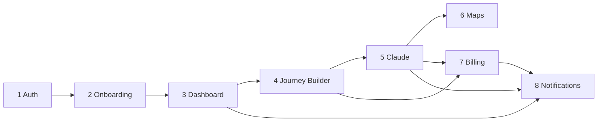

# Wayheld — Product Roadmap

The complete application structure, defined **before backend implementation**.
This document turns the validated data foundation into a concrete product plan:
sitemap, dashboard & journey-builder information architecture, API contract, and
the exact build order.

References:
[BUSINESS_FLOW.md](BUSINESS_FLOW.md) ·
[DATA_ARCHITECTURE.md](DATA_ARCHITECTURE.md) ·
[prisma/schema.prisma](prisma/schema.prisma)

> **Planning only.** No implementation code. API routes are the intended
> `/api/v1/*` contract (stable for web + future mobile). Already-built frontend:
> landing page, `/login`, `/signup`, `/forgot-password`, `/onboarding`.

---

## 1. Sitemap

```mermaid
flowchart TD
    subgraph Public
      LP[/ Landing/]
      WHY[/#why Why broken/]
      HOW[/#how How it thinks/]
      JRN[/#journeys Featured/]
      MEM[/#membership Membership/]
    end
    subgraph Auth
      LOGIN[/login/]
      SIGNUP[/signup/]
      FORGOT[/forgot-password/]
      RESET[/reset-password/]
      VERIFY[/verify-email/]
    end
    subgraph Onboarding
      OB[/onboarding · steps 1-6/]
    end
    subgraph App
      DASH[/dashboard/]
      JL[/journeys/...]
      SAVED[/saved/]
      BILL[/billing/...]
      SET[/settings/...]
    end

    LP --> SIGNUP --> OB --> DASH
    LP --> LOGIN --> DASH
    DASH --> JL
    DASH --> SAVED
    DASH --> BILL
    DASH --> SET
```

### 1.1 Public pages
| Route | Purpose | Auth |
| --- | --- | --- |
| `/` | Landing (hero, why, how, journeys, membership, CTA, footer) | Public |
| `/#why`, `/#how`, `/#journeys`, `/#membership` | In-page sections (built) | Public |
| `/legal/privacy`, `/legal/terms`, `/legal/cookies` | Legal | Public |

### 1.2 Auth pages
| Route | Purpose | Auth | Status |
| --- | --- | --- | --- |
| `/login` | Sign in (email + OAuth) | Guest-only | ✅ built (FE) |
| `/signup` | Create account | Guest-only | ✅ built (FE) |
| `/forgot-password` | Request reset link | Guest-only | ✅ built (FE) |
| `/reset-password` | Set new password (token) | Token | ⬜ to build |
| `/verify-email` | Confirm email (token) | Token | ⬜ to build |

### 1.3 Onboarding pages
| Route | Purpose | Auth | Status |
| --- | --- | --- | --- |
| `/onboarding` | 6-step flow (Account, Style, Interests, Pace, Preferences, Complete) | Authed, onboarding incomplete | ✅ built (FE) |

Guard: completed users are redirected to `/dashboard`; incomplete authed users
are routed back to `/onboarding`.

### 1.4 Dashboard pages
| Route | Purpose | Auth |
| --- | --- | --- |
| `/dashboard` | Home: journeys, recommendations, credits, activity | Authed |
| `/saved` | Saved journeys + saved places (tabs) | Authed |
| `/saved/places` | Saved places list + map | Authed |
| `/recommendations` | Full recommendation feed | Authed |

### 1.5 Journey Builder pages
| Route | Purpose | Auth |
| --- | --- | --- |
| `/journeys` | All journeys (list/grid, filters) | Authed |
| `/journeys/new` | Create-journey intent form | Authed |
| `/journeys/[id]` | Journey detail (itinerary + map) | Owner |
| `/journeys/[id]/build` | Builder (generate + refine workspace) | Owner |
| `/journeys/[id]/share` | Share settings (future) | Owner |
| `/j/[token]` | Public read-only shared journey (future) | Public (unlisted) |

### 1.6 Billing pages
| Route | Purpose | Auth |
| --- | --- | --- |
| `/billing` | Plan, subscription status, credits summary | Authed |
| `/billing/plans` | Compare/upgrade plans | Authed |
| `/billing/credits` | Credit balance + ledger history | Authed |
| `/billing/checkout/return` | Stripe Checkout return handler | Authed |
| (external) | Stripe Customer Portal | Authed |

### 1.7 Settings pages
| Route | Purpose | Auth |
| --- | --- | --- |
| `/settings` | Overview / index | Authed |
| `/settings/profile` | Name, avatar, home base, locale | Authed |
| `/settings/preferences` | Travel style, interests, pace, preferences | Authed |
| `/settings/account` | Email, password, connected providers | Authed |
| `/settings/notifications` | Channel + type toggles | Authed |
| `/settings/danger` | Export data, delete account | Authed |

---

## 2. Dashboard Information Architecture

Layout: persistent left nav (Dashboard, Journeys, Saved, Billing, Settings) +
top bar (greeting, credits pill, notifications bell, avatar menu). Content is a
responsive widget grid.

### 2.1 Widgets

| Widget | Data shown | Source tables | Empty state | Loading state |
| --- | --- | --- | --- | --- |
| **Greeting + intent bar** | "Welcome back, {firstName}", quick "Plan a journey" input | `Profile` | First name fallback "traveller"; prompt to start first journey | Skeleton line + input |
| **Credits pill** | Balance, plan tier, "unlimited" badge | `CreditWallet`, `Subscription`, `MembershipPlan` | "0 credits · Upgrade" | Shimmer pill |
| **Continue journey** | Most recent `DRAFT`/`REFINING` journey w/ resume CTA | `Journey` | Hidden if none | Card skeleton |
| **Your journeys** | Recent journeys (image, title, status, days, stops count) | `Journey`, `JourneyStop` | "No journeys yet — create your first" + CTA | 3 card skeletons |
| **Recommended for you** | AI/editorial picks (image, title, reason, score) | `DestinationRecommendation` | "We're learning your taste — check back soon" | Horizontal skeleton rail |
| **Saved places** | Pins/cards of saved places + mini map | `SavedPlace` | "Nothing saved yet — save places you love" | Map + card skeleton |
| **Recent activity** | Timeline of key events | `UserActivity` | "Your activity will appear here" | List skeleton |
| **Notifications** (panel) | Unread/recent notifications | `Notification` | "You're all caught up" | List skeleton |

### 2.2 Global states
- **First-run (post-onboarding):** emphasise the intent bar + "Create your first
  journey"; hide empty widgets or show inviting empty states.
- **Loading:** every widget renders its own skeleton independently (no full-page
  spinner) so the shell appears instantly.
- **Error:** per-widget inline retry; the page never hard-fails on one widget.
- **Reduced data (Free tier):** credits pill shows upgrade affordance; generation
  gated with an upgrade modal.

---

## 3. Journey Builder Information Architecture

Workspace layout (desktop): left = itinerary list (stops), center/right = map,
bottom or side = AI refine panel. Mobile: stacked tabs (Itinerary · Map ·
Refine).

### 3.1 Create Journey flow
1. `/journeys/new`: intent (`originQuery`), optional dates, travelers, budget,
   pace (prefilled from `TravelPreference`).
2. Submit → creates `Journey` (`DRAFT`) → redirect to `/journeys/[id]/build`.
- **States:** validating intent → draft created. **Empty:** prefilled prefs
  shown as chips. **Rules:** entitlement check before allowing generate.

### 3.2 AI Generation flow
1. On builder load with a `DRAFT`, show "Generate itinerary" CTA (cost shown:
   "1 credit" or "included").
2. Generate → `Journey.status = GENERATING`; stream progress; render stops as
   they resolve; frame map to `boundingBox`.
3. Complete → `READY`; `JOURNEY_READY` notification.
- **Loading:** streamed skeleton stops + "Wayheld is planning…" with the same
  presence language as the hero AI panel. **Error:** `FAILED` state with retry;
  no credit charged (auto-refund). **Rules:** Zod-validate output; resolve each
  stop to a Google Place.

### 3.3 Refinement flow
1. Refine panel: natural-language input + quick actions (Slower, Add days,
   Remove stop, Avoid crowds, Reorder).
2. Submit → `JourneyRefinement` + `AiGeneration` (`JOURNEY_REFINEMENT`);
   `status = REFINING`; diff applied; `version++`; back to `READY`.
- **Loading:** inline "thinking" indicator; affected stops animate. **Empty:**
  suggested refine chips. **Rules:** prior refinements/stops sent as context;
  pricing policy (light edits free, regen costs credit).

### 3.4 Save flow
- Save journey (`SavedJourney`, idempotent) and save individual places
  (`SavedPlace`, dedupe on `googlePlaceId`) from stop cards or the map.
- **States:** toggle filled/unfilled; optimistic with rollback on error.

### 3.5 Share flow (future-ready)
- `/journeys/[id]/share`: set visibility (PRIVATE → UNLISTED/PUBLIC), generate a
  token link `/j/[token]` (read-only).
- **Rules:** requires a future `Journey.visibility` enum + share token; no schema
  break (additive). Public view hides owner-only controls and credit actions.

---

## 4. API Contract Plan

All endpoints are `/api/v1/*`, JSON, owner-scoped unless noted. Auth column:
**Guest** (no session), **User** (valid session), **Owner** (session + resource
ownership), **Token** (signed link), **Webhook** (Stripe signature).

### 4.1 Auth
| Screen | Method · Endpoint | Request | Response | Auth |
| --- | --- | --- | --- | --- |
| Signup | `POST /auth/signup` | `{ name, email, password, acceptedTerms }` | `{ user: {id,email}, session }` | Guest |
| Login | `POST /auth/login` | `{ email, password }` | `{ user, session }` | Guest |
| OAuth | `GET /auth/callback/:provider` | provider code | redirect + session | Guest |
| Forgot | `POST /auth/forgot-password` | `{ email }` | `{ ok: true }` (always) | Guest |
| Reset | `POST /auth/reset-password` | `{ token, password }` | `{ ok: true }` | Token |
| Verify email | `POST /auth/verify-email` | `{ token }` | `{ ok: true }` | Token |
| Logout | `POST /auth/logout` | — | `{ ok: true }` | User |
| Session | `GET /auth/session` | — | `{ user, profile, onboardingComplete }` | User |

### 4.2 Onboarding
| Screen | Method · Endpoint | Request | Response | Auth |
| --- | --- | --- | --- | --- |
| Options | `GET /onboarding/options` | — | `{ styles[], interests[] }` | User |
| Save step | `PATCH /onboarding` | `{ step, data }` | `{ profile, preferences }` | User |
| Complete | `POST /onboarding/complete` | `{}` | `{ onboardingCompletedAt }` | User |

### 4.3 Dashboard
| Screen | Method · Endpoint | Request | Response | Auth |
| --- | --- | --- | --- | --- |
| Dashboard summary | `GET /dashboard` | — | `{ profile, credits, journeys[], recommendations[], savedPlaces[], activity[] }` | User |
| Recommendations | `GET /recommendations?status=` | query | `{ items[], nextCursor }` | User |
| Rec. status | `PATCH /recommendations/:id` | `{ status }` | `{ recommendation }` | Owner |

### 4.4 Journeys
| Screen | Method · Endpoint | Request | Response | Auth |
| --- | --- | --- | --- | --- |
| List | `GET /journeys?status=&cursor=` | query | `{ items[], nextCursor }` | User |
| Create | `POST /journeys` | `{ originQuery, startDate?, endDate?, travelerCount?, budget?, pace? }` | `{ journey }` (DRAFT) | User |
| Detail | `GET /journeys/:id` | — | `{ journey, stops[], refinements[] }` | Owner |
| Update | `PATCH /journeys/:id` | `{ title?, ... }` | `{ journey }` | Owner |
| Delete | `DELETE /journeys/:id` | — | `{ ok: true }` (soft) | Owner |
| Generate | `POST /journeys/:id/generate` | `{}` | stream → `{ journey, stops[] }` | Owner |
| Refine | `POST /journeys/:id/refine` | `{ type, instruction?, params? }` | stream → `{ journey, stops[], refinement }` | Owner |
| Refinements | `GET /journeys/:id/refinements` | — | `{ items[] }` | Owner |
| Save journey | `POST /journeys/:id/save` / `DELETE` | — | `{ saved }` | Owner |
| Share (future) | `POST /journeys/:id/share` | `{ visibility }` | `{ shareToken, url }` | Owner |
| Public view | `GET /shared/:token` | — | `{ journey, stops[] }` | Token |

### 4.5 Places & Saves
| Screen | Method · Endpoint | Request | Response | Auth |
| --- | --- | --- | --- | --- |
| Save place | `POST /places/save` | `{ googlePlaceId, kind, name, lat, lng, ... }` | `{ savedPlace }` | User |
| Remove place | `DELETE /places/:id` | — | `{ ok: true }` | Owner |
| Saved places | `GET /saved/places` | — | `{ items[] }` | User |
| Saved journeys | `GET /saved/journeys` | — | `{ items[] }` | User |
| Place search | `GET /maps/places?q=` | query | `{ predictions[] }` (Google proxy) | User |
| Place details | `GET /maps/places/:placeId` | — | `{ place }` | User |

### 4.6 Billing & Credits
| Screen | Method · Endpoint | Request | Response | Auth |
| --- | --- | --- | --- | --- |
| Plans | `GET /plans` | — | `{ plans[] }` | Public |
| Checkout | `POST /checkout/session` | `{ planId }` | `{ url }` (Stripe) | User |
| Portal | `POST /billing/portal` | — | `{ url }` | User |
| Subscription | `GET /billing/subscription` | — | `{ subscription, plan }` | User |
| Credits | `GET /credits` | — | `{ balance, lifetime, transactions[] }` | User |
| Stripe webhook | `POST /webhooks/stripe` | Stripe event | `{ received: true }` | Webhook |

### 4.7 Account, Notifications, Activity
| Screen | Method · Endpoint | Request | Response | Auth |
| --- | --- | --- | --- | --- |
| Get profile | `GET /me` | — | `{ user, profile, preferences }` | User |
| Update profile | `PATCH /me/profile` | `{ firstName?, ... }` | `{ profile }` | User |
| Update prefs | `PATCH /me/preferences` | `{ pace?, styles[]?, interests[]?, ... }` | `{ preferences }` | User |
| Change password | `POST /me/password` | `{ current, next }` | `{ ok: true }` | User |
| Export data | `POST /me/export` | — | `{ jobId }` | User |
| Delete account | `DELETE /me` | `{ confirm }` | `{ ok: true }` (soft) | User |
| Notifications | `GET /notifications?unread=` | query | `{ items[], unreadCount }` | User |
| Mark read | `PATCH /notifications/:id` | `{ readAt }` | `{ notification }` | Owner |
| Prefs (notif) | `PATCH /me/notification-settings` | `{ ... }` | `{ settings }` | User |

**Conventions:** cursor pagination (`cursor`/`nextCursor`); standard error
envelope `{ error: { code, message, fields? } }`; all mutations idempotent where
external (webhooks via `externalRef`); rate-limited per user.

---

## 5. Build Order

Each phase is independently shippable and testable. Frontend for landing, auth
and onboarding already exists; phases below add persistence + backend behind the
existing UI and new screens.

### Phase 1 — Authentication
- **Build:** NextAuth (credentials + Google/Apple), `User`/`Account`/`Session`/
  `VerificationToken`, email verify + reset, route guards, `CreditWallet`
  provisioning on signup.
- **APIs:** §4.1. **Tables:** identity + `CreditWallet`.
- **Exit criteria:** real signup/login/logout/reset; protected routes enforce
  session; new users land on `/onboarding`.

### Phase 2 — Onboarding persistence
- **Build:** persist the existing 6-step flow; seed `TravelStyle`/`Interest`;
  write `Profile`/`TravelPreference`/joins; completion guard.
- **APIs:** §4.2. **Tables:** profile + preference + catalogs.
- **Exit criteria:** answers persist and resume; completed users skip onboarding.

### Phase 3 — Dashboard
- **Build:** dashboard shell + widgets reading real data; `/saved`,
  `/settings/*` read/write; activity logging.
- **APIs:** §4.3, §4.7. **Tables:** read across user-owned models;
  `UserActivity` writes.
- **Exit criteria:** dashboard renders real journeys/saves/activity with proper
  empty + loading states.

### Phase 4 — Journey Builder (no AI yet)
- **Build:** `/journeys`, `/journeys/new`, `/journeys/[id]`, builder shell;
  CRUD on `Journey`/`JourneyStop` (manual/stub data); save flows.
- **APIs:** §4.4 (minus generate/refine), §4.5 saves.
- **Exit criteria:** create/edit/save journeys and stops end-to-end with
  placeholder content.

### Phase 5 — Claude integration
- **Build:** Claude client, prompt templates, Zod output schemas; wire
  `generate` + `refine`; `AiGeneration` + `AiPromptLog`; credit pre-auth/commit
  + refund-on-failure.
- **APIs:** `POST /journeys/:id/generate`, `/refine`; `GET /credits`.
- **Exit criteria:** real itineraries generated + refined; every call audited;
  credits debited atomically; failures don't charge.

### Phase 6 — Maps integration
- **Build:** Google Places proxy endpoints; resolve stops to `googlePlaceId` +
  lat/lng; interactive map in builder, dashboard, saved places; `boundingBox`
  framing.
- **APIs:** §4.5 maps. **Tables:** geo fields on `JourneyStop`/`SavedPlace`.
- **Exit criteria:** every stop/place is map-pinned; map and itinerary stay in
  sync.

### Phase 7 — Billing
- **Build:** `MembershipPlan` seed mapped to Stripe; Checkout + Customer Portal;
  webhook handler (idempotent); credit grants on purchase/renewal; entitlement
  gating across builder.
- **APIs:** §4.6. **Tables:** `Subscription`, `CreditTransaction`,
  `CreditWallet`.
- **Exit criteria:** users can subscribe/buy; credits grant via webhook;
  renewals and dunning handled; gating enforced.

### Phase 8 — Notifications
- **Build:** in-app notification center; emit on key events (journey ready,
  billing, credits, recommendations); email channel; settings toggles; (push
  scaffold for mobile later).
- **APIs:** §4.7 notifications. **Tables:** `Notification`.
- **Exit criteria:** users receive + manage notifications across in-app/email.

### Dependency graph


---

## 6. Cross-phase guardrails
- **Auth on every endpoint** per §4 (Guest/User/Owner/Token/Webhook).
- **Atomic money/credits** writes; **idempotent** external events.
- **Per-widget loading/empty/error** states — never a blank dashboard.
- **Accessibility & responsiveness** consistent with the design system
  ([DESIGN_SYSTEM.md](DESIGN_SYSTEM.md)).
- **Mobile parity:** stable `/api/v1` contract; device-aware sessions.
- **No schema changes required** for Phases 1–8; Share is additive (Phase 4+
  future).

This roadmap is implementation-ready: each phase has clear scope, APIs, tables
and exit criteria, sequenced so every layer rests on a finished one below it.
